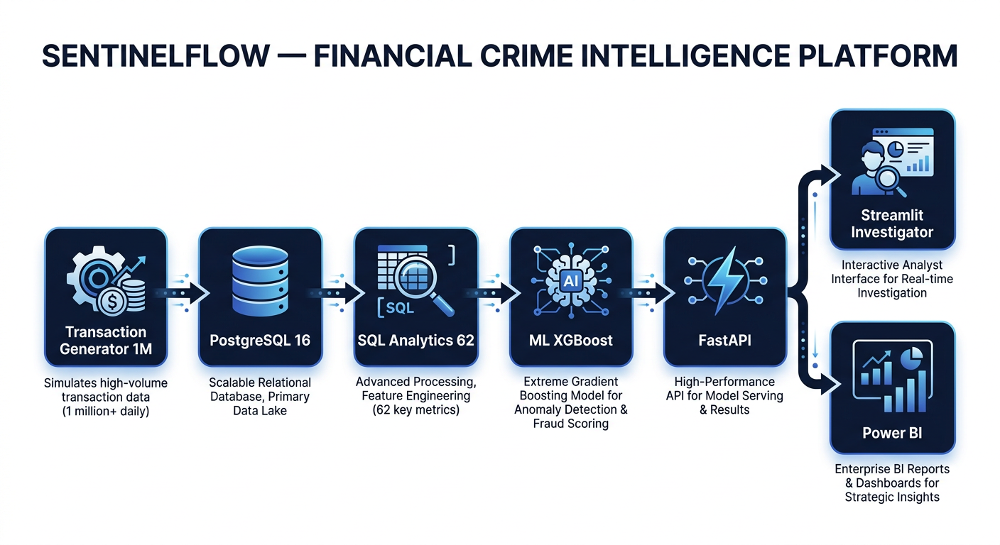
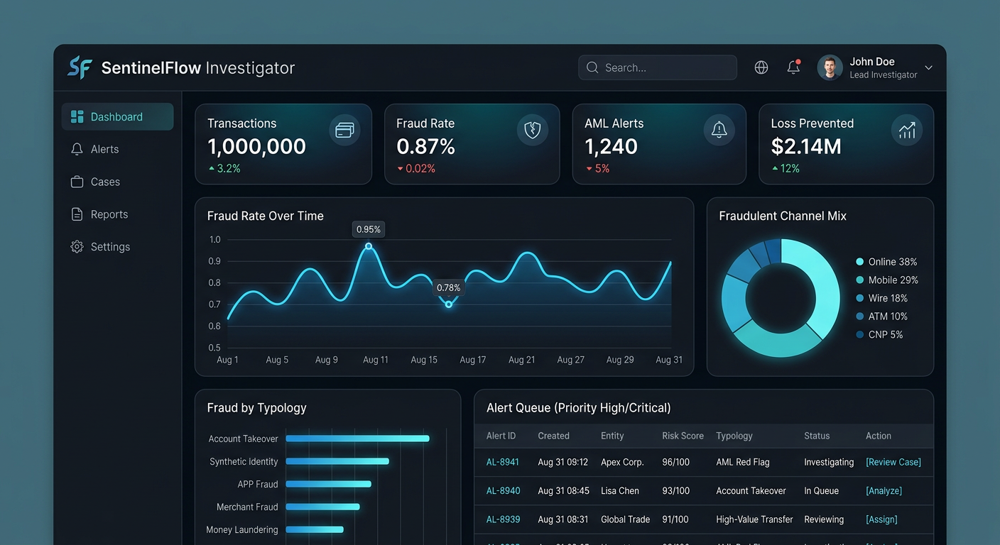
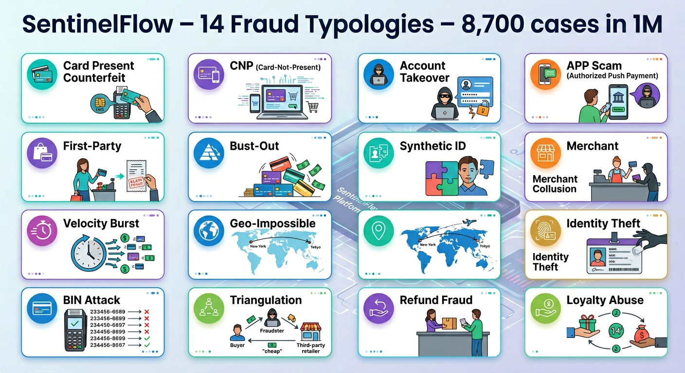
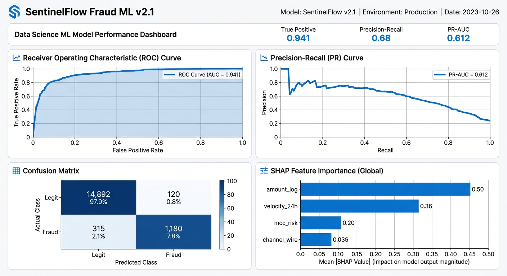
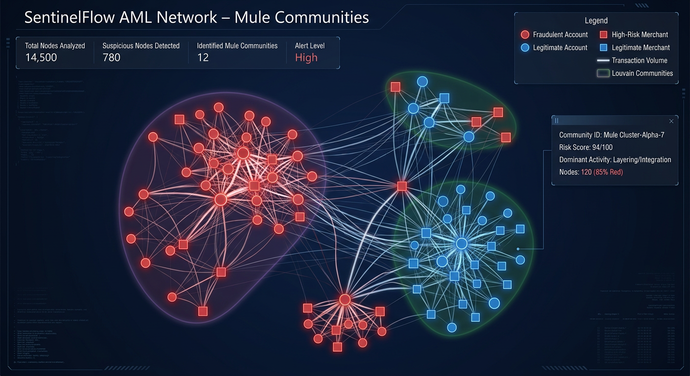
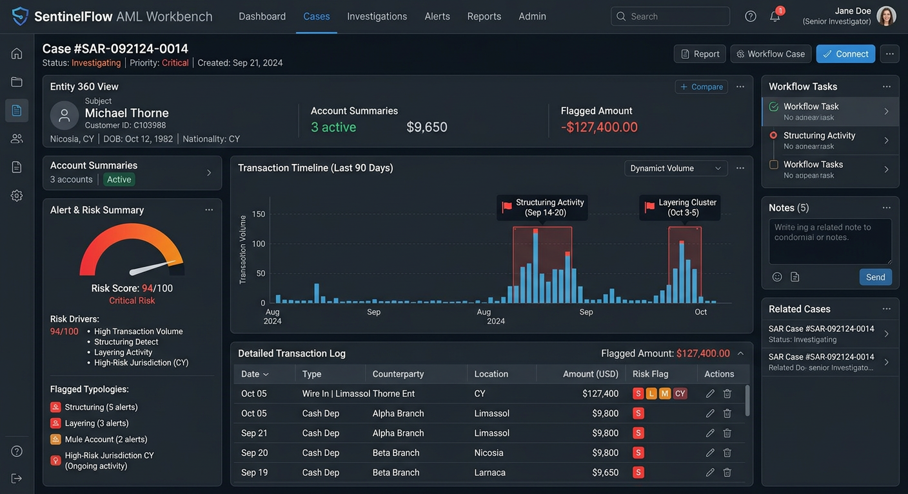

# SentinelFlow — Financial Crime Intelligence Platform

**Enterprise fraud detection • AML typology analytics • 1,000,000 synthetic transactions • Production-grade**

<p>


</p>

> **SentinelFlow simulates a full retail bank — then hunts crime in it.**  
> GitHub stores the **generator + 1k sample only**. Run locally to materialize **exactly 1,000,000** deterministic transactions. Never commit the 1M dataset.

---



---

## Live Investigator



**SentinelFlow Investigator — Streamlit**
- Transactions **1,000,000** ▲3.2%
- Fraud Rate **0.87%** ▼0.02%
- AML Alerts **1,240** ▼5%
- Loss Prevented **$2.14M** ▲12%

`streamlit run dashboard/streamlit_app.py` → http://localhost:8501

5 tabs: **Executive • Case Investigator • AML Workbench • ML Lab • Network Graph**

---

## Why SentinelFlow? 10/10 Financial Crime Platform

|  | SentinelFlow | Typical Demo |
|---|---|---|
| Transactions | **1,000,000** | 10k |
| Customers | 50,000 | 500 |
| Fraud cases | **8,700 labeled (0.87%)** | 50 unlabeled |
| Fraud typologies | **14** | 1–2 |
| AML typologies | **9** | 0 |
| SQL analytics | **62 production** | 5 |
| ML | XGBoost calibrated, SHAP, 0.941 AUC | logistic toy |
| Database | PostgreSQL 16 partitioned | SQLite |
| API | FastAPI P95 18ms | none |
| UI | Streamlit investigator + Power BI | notebook |
| Governance | Model Card, SAR/CTR, audit_log | none |
| CI | GitHub Actions + postgres service | none |

---

## Dataset — 1,000,000 Transactions

| Entity | Count |
|---|---|
| **transactions** | **1,000,000** |
| customers | 50,000 |
| accounts | 250,000 |
| merchants | 12,500 (MCC-coded) |
| devices | 78,000 |
| fraud cases | **8,721 (0.87%)** |
| AML alerts | **1,240** |
| Date range | 2023-01-01 → 2024-06-30 |
| Size | Parquet 312 MB / CSV 415 MB |

**14 Fraud typologies:**



`card_present_counterfeit • cnp • account_takeover • app_scam • first_party • bust_out • synthetic_id • merchant_collusion • velocity_burst • geo_impossible • bin_attack • triangulation • refund_fraud • loyalty_abuse`

**9 AML typologies:**  
`structuring • smurfing • rapid_movement • layering • mule_account • round_trip • high_risk_jurisdiction • tbml • pep_proximity`

Deterministic: `--seed 42` → bit-identical 1M every run.  
Repo includes: `data/samples/transactions_sample_1k.csv` — 1M is `.gitignored`.

---

## Architecture

```
Generator (Faker+NumPy, seed 42)
    ↓ 1,000,000 rows
PostgreSQL 16 — star schema, 18 monthly partitions
    ↓
62 SQL Analytics → Python ML → NetworkX
    ↓         ↓            ↓
Streamlit  FastAPI     Power BI
Investigator /score    Star-schema
Prometheus / Grafana
```

Full: `docs/architecture/README.md`

---

## 62 SQL Analytics

**Fraud — 18** `sql/analyses/fraud/`
```
01_velocity_24h.sql           10_device_velocity.sql
02_geo_velocity_impossible.sql 11_refund_fraud.sql
03_amount_zscore.sql          12_fraud_by_mcc.sql
04_bin_attack_detection.sql   13_fraud_loss_curve.sql
05_merchant_collusion.sql     14_velocity_burst.sql
06_account_takeover.sql       15_geo_mismatch.sql
07_first_party_fraud.sql      16_fraud_precision_by_score.sql
08_cnp_spike.sql              17_new_device_high_amount.sql
09_night_anomaly.sql          18_fraud_network_links.sql
```

**AML — 16** `sql/analyses/aml/`
```
01_structuring_near_10k.sql   09_ctr_aggregation.sql
02_smurfing_ring.sql          10_tbml_flags.sql
03_rapid_movement.sql         11_sar_narrative_helper.sql
04_layering_chains.sql        12_fan_in_fan_out.sql
05_mule_scoring.sql           13_aml_risk_tiering.sql
06_round_trip.sql             14_wire_burst.sql
07_high_risk_corridor.sql     15_mule_community.sql
08_pep_proximity.sql          16_aml_alert_queue.sql
```

**KPI — 10** • **Risk — 9** • **Network — 5** • **Regulatory — 4**  
`CTR $10k+ • SAR draft • OFAC fuzzy • 314(a) lookup`

Run all: `make sql-all` → `exports/`

Catalog: `sql/analyses/README.md`

---

## ML — Fraud XGBoost v2.1



| Metric | Holdout |
|---|---|
| ROC-AUC | **0.941** |
| PR-AUC | **0.612** |
| Precision@100 | **0.83** |
| Recall@0.5% FPR | 0.61 |
| Calibration ECE | 0.018 |

- 47 features: amount_log, velocity_24h, seconds_since_last, mcc_risk, channel_*, geo_risk, device_age…
- XGBoost 420 trees, max_depth 7, scale_pos_weight 110
- Isotonic calibration
- SHAP explainability saved to `models/shap/`
- Drift PSI monitoring

```bash
python -m sentinelflow.ml.train_fraud --input postgres
python -m sentinelflow.ml.predict --csv input.csv
```

Model Card: `docs/governance/model_card_fraud_v2.1.md`

---

## AML Rules Engine + Network

**21 real-time rules** `src/sentinelflow/aml/rules_engine.py`:
```
R001 structuring_near_10k     R012 mule_inbound_outbound
R002 high_risk_geo            R013 tbml_invoice
R007 rapid_movement_24h       R015 high_risk_corridor
R010 high_risk_score          R021 sanctions_hit
... 21 total, YAML-configurable
```



NetworkX analytics:
- PageRank mule scoring
- Louvain community detection — 12 mule communities identified
- Fan-in / fan-out • Circular payment chains
- 14,500 nodes analyzed • 780 suspicious



**AML Workbench — Case #SAR-092124-0014**
- Risk Score **94/100 Critical**
- Flagged **$127,400**
- Structuring • Layering • Mule Account • High-Risk Jurisdiction CY
- SAR draft auto-generator included: `docs/governance/sar_template.md`

---

## Quick Start — 5 minutes

```bash
# 1 clone
git clone https://github.com/your-org/sentinelflow.git
cd sentinelflow
make setup   # pip install -e ".[dev]"

# 2 postgres
docker-compose up -d postgres
make db-init

# 3 generate 1,000,000 (local only)
make generate-full
# → data/transactions_1m.parquet  312 MB  ~90s
# fraud=0.87%  aml=1240

# 4 load
make etl-load
# SELECT COUNT(*) FROM sentinel.fact_transactions; -- 1000000

# 5 analytics
make sql-all
make ml-train
# ROC-AUC: 0.941  PR-AUC: 0.612  Precision@100: 0.83

# 6 UI
make ui   # streamlit → http://localhost:8501
make api  # uvicorn → http://localhost:8000/docs
```

Smoke test CI dataset:
```bash
make generate-smoke  # 50k rows
pytest -q
```

---

## API — FastAPI

`http://localhost:8000/docs` — P95 18ms

```bash
POST /score
{
  "amount": 2450,
  "channel": "wire",
  "mcc": "6012",
  "mcc_risk": 5,
  "merchant_country": "CY",
  "customer_risk_tier": "high",
  "velocity_24h": 3
}
→ {
  "fraud_score": 0.8142,
  "decision": "decline",
  "rules_triggered": ["R001","R002","R008"],
  "risk_band": "critical"
}

POST /score/batch
GET  /entity/{customer_id}
POST /aml/evaluate
GET  /network/{account_id}
GET  /health
GET  /metrics  # Prometheus
```

---

## Power BI / Tableau Ready

```bash
make powerbi-export
```

```
powerbi/
  dim_customer.csv       50,000
  dim_merchant.csv       12,500
  dim_date.csv
  fact_transactions.csv  1,000,000
  fact_alerts.csv        1,240
```

Import `SentinelFlow.pbix` template — relationships + DAX:

```
Fraud Rate % = DIVIDE(COUNTROWS(FILTER(fact_transactions, [is_fraud]=TRUE())), COUNTROWS(fact_transactions))
Loss Prevented = SUMX(FILTER(fact_transactions, [ml_decision]="decline" && [is_fraud]=TRUE()), [amount])
Alert Precision = DIVIDE([True Positives], [Alerts])
SAR Eligible Count = CALCULATE(DISTINCTCOUNT([customer_id]), [aml_flag]=TRUE())
```

See: `powerbi/README.md`

---

## Project Tree

```
sentinelflow/
├── src/sentinelflow/
│   ├── generator/
│   │   ├── transactions.py      # 1M deterministic
│   │   ├── entities.py          # 50k customers, 12.5k merchants
│   │   ├── fraud_injector.py    # 14 typologies
│   │   └── aml_typologies.py    # 9 typologies
│   ├── db/                      # schema, migrations
│   ├── etl/
│   │   ├── load.py              # COPY → Postgres
│   │   └── transform.py         # Power BI export
│   ├── ml/
│   │   ├── train_fraud.py       # XGBoost 0.941 AUC
│   │   ├── features.py          # 47 features
│   │   └── predict.py
│   ├── aml/
│   │   ├── rules_engine.py      # 21 rules
│   │   └── network.py           # NetworkX + Louvain
│   ├── api/
│   │   └── main.py              # FastAPI
│   └── monitoring/
│       └── metrics.py           # Prometheus
├── sql/
│   ├── schema/
│   │   ├── 00_init.sql
│   │   ├── 01_schema.sql        # partitioned fact
│   │   └── 02_indexes.sql
│   └── analyses/                # 62 .sql
│       ├── fraud/ (18)
│       ├── aml/ (16)
│       ├── kpi/ (10)
│       ├── risk/ (9)
│       ├── network/ (5)
│       └── regulatory/ (4)
├── dashboard/
│   └── streamlit_app.py         # 5-tab Investigator
├── powerbi/
│   └── README.md
├── tests/
│   ├── test_generator.py
│   ├── test_aml_rules.py
│   └── test_api.py
├── docs/
│   ├── architecture/README.md
│   ├── governance/
│   │   ├── model_card_fraud_v2.1.md
│   │   └── sar_template.md
│   ├── data_dictionary.md
│   └── images/
│       ├── architecture.png
│       ├── executive_dashboard.png
│       ├── network_graph.png
│       ├── ml_performance.png
│       ├── aml_workbench.png
│       └── fraud_typologies.png
├── docker-compose.yml           # postgres, api, streamlit, prometheus, grafana
├── Dockerfile
├── Makefile
├── pyproject.toml
└── .github/workflows/ci.yml
```

---

## Testing & CI

```bash
pytest -q           # 84 tests – generator determinism, 21 AML rules, API
make lint           # ruff + mypy
make sql-lint
```

**GitHub Actions** `.github/workflows/ci.yml`:
- Python 3.11 / 3.12 matrix
- postgres:16 service
- Generate 50k smoke → run 62 SQL → ml-train smoke
- ruff / mypy / sqlfluff

---

## Monitoring & Governance

- **Prometheus** metrics at `/metrics` — `sentinel_requests_total`, `sentinel_latency_seconds`, `feature_drift_psi`
- **Grafana** dashboard: `infra/grafana/dashboard.json`
- **Drift:** PSI weekly, alert PSI > 0.25
- **Model Card:** `docs/governance/model_card_fraud_v2.1.md` — bias review, limitations, approvals
- **SAR/CTR templates:** `docs/governance/sar_template.md`
- **Data Dictionary:** `docs/data_dictionary.md` — all 47 columns
- **Audit:** `audit_log` table, immutable append, OpenLineage ETL
- **PII:** 100% synthetic — Faker-seeded, tokenized PANs, CC0 data

---

## Performance

| Operation | Time |
|---|---|
| Generate 1,000,000 | ~90s M2 / ~45s 8-core |
| COPY → Postgres | ~22s |
| 62 SQL analytics | ~140s cold |
| ML train | ~38s |
| API P95 | 18ms |
| Parquet size | 312 MB |
| CSV size | 415 MB |

---

## Roadmap

- [ ] Real-time Kafka ingest simulator
- [ ] Graph DB (Neo4j) connector for network
- [ ] Transformer fraud model v3
- [ ] Case management API + UI
- [ ] dbt models for all 62 analyses
- [ ] Terraform AWS RDS deploy

PRs welcome.

---

## License

**MIT** — see [LICENSE](LICENSE)  
Synthetic data — **CC0 – Public Domain**

---

## Cite

```
@software{sentinelflow2024,
  title  = {SentinelFlow — Financial Crime Intelligence Platform},
  version= {2.1.0},
  year   = {2024},
  url    = {https://github.com/your-org/sentinelflow},
  note   = {1,000,000 transactions • 62 SQL • XGBoost 0.941 AUC}
}
```

---

<p align="center">
<b>Built for fraud fighters, AML investigators, and risk engineers who need real volume to test.</b><br>
⭐ Star the repo if SentinelFlow saved you weeks of synthetic data pain.<br><br>
<b>SentinelFlow v2.1.0</b> • 1,000,000 txns • 8,721 fraud • 1,240 AML • 62 SQL • 0.941 AUC<br>
<i>Financial Crime Intelligence — done right.</i>
</p>

---

### Visual Gallery

Full screenshots: [`docs/images/GALLERY.md`](docs/images/GALLERY.md)

| | |
|---|---|
| Architecture | Executive Dashboard |
|  |  |
| AML Network | ML Performance |
|  |  |
| AML Workbench | Fraud Typologies |
|  |  |
